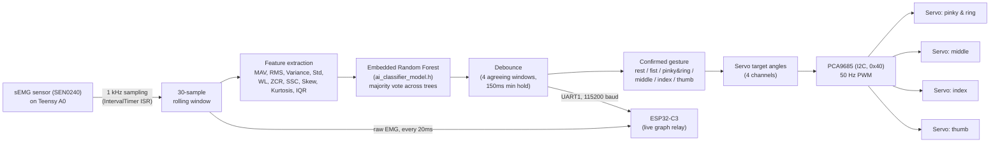
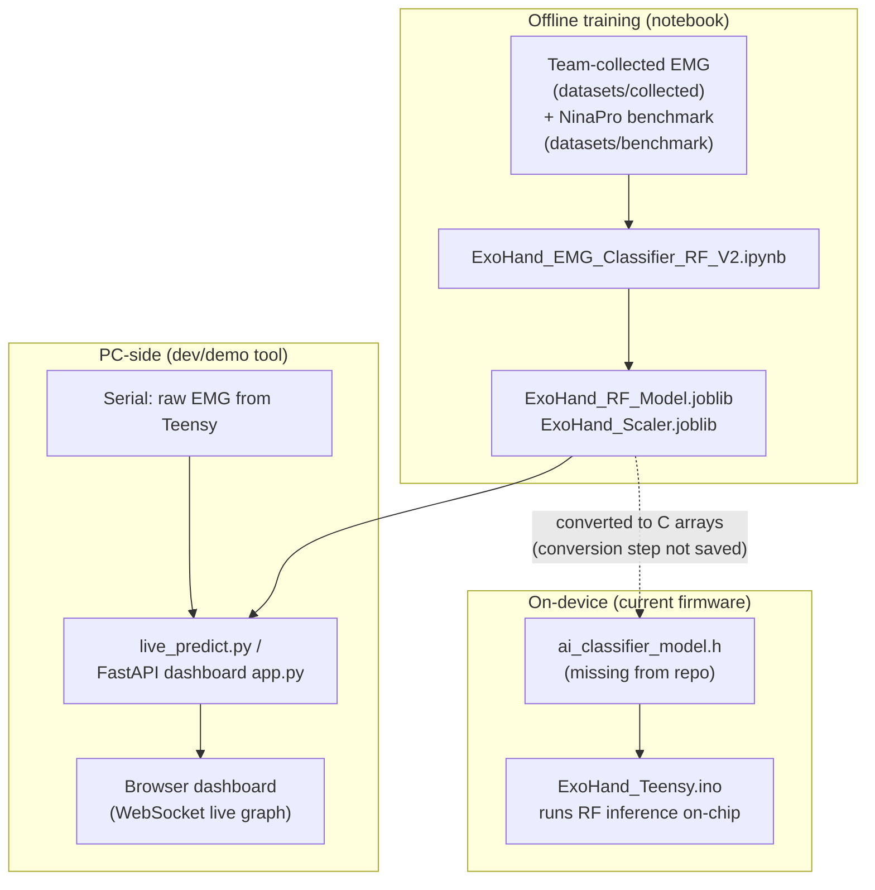

# Architecture

## Signal flow (EMG → Teensy → PCA9685 → servos)

## Two parallel inference paths

The project has two separate ways of running the trained classifier, built at different times and not unified:

The on-device path (`ExoHand_Teensy.ino`) is the intended final form — the Teensy classifies and drives servos with no PC required. The PC-side path (`live_predict.py`, the FastAPI dashboard) is a development and demo tool that reads raw EMG over serial and classifies on a laptop instead, useful for visualizing the live signal and testing the model before/without embedding it.

## Hardware stack

- **MCU:** Teensy (4.0 per firmware header comments; the dashboard backend's comments say 4.1 — kept as found, not resolved here)
- **Servo driver:** PCA9685, I2C address `0x40`, 50 Hz PWM
- **Servos:** MG996R (or equivalent), 4 channels — pinky&ring, middle, index, thumb
- **EMG sensor:** SEN0240, single analog channel on Teensy `A0` in the current firmware (earlier firmware used 3 channels: flexor/extensor/extra)
- **Wireless telemetry:** ESP32-C3, intended to relay live EMG + gesture data over UART for a graph display. A servo-test sketch exists for the ESP32 side; no WiFi/UART-relay sketch was found in the saved files.
- **Power:** 7.4V 2S LiPo, stepped down for servo and logic rails (per project README notes)

## VR integration

A VR integration goal is part of the project's stated direction, but no VR-specific code was found in the files reviewed here. Treat this as a future goal, not a built feature.

## Signal processing pipeline (current, on team-collected + benchmark data)

1. Sample EMG at 1000 Hz.
2. Maintain a 30-sample rolling window, advancing in steps of 5 samples.
3. Extract 10 features per window: MAV (scaled), RMS, variance, standard deviation, waveform length, zero-crossing rate, slope sign changes, skewness, kurtosis, IQR.
4. Classify with a Random Forest (hard majority vote across trees).
5. Debounce: require 4 consecutive windows to agree, plus a minimum 150ms hold, before changing the confirmed gesture.
6. Map confirmed gesture to per-finger servo open/closed targets, moving smoothly (3°/step, every 15ms) rather than snapping.

An earlier, simpler pipeline (`Filter_signals.py`, `Exohand_emg_with_filter.ino`) used a 20–450 Hz bandpass filter + 50 Hz notch filter + RMS thresholding for binary rest/active detection, validated against the public NinaPro benchmark dataset. This was the proof-of-concept before moving to the multi-class, team-data-trained classifier described above.
